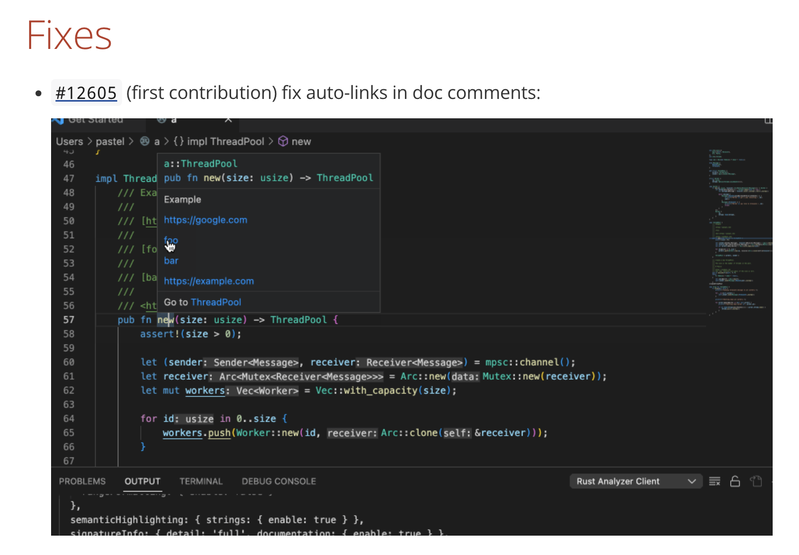
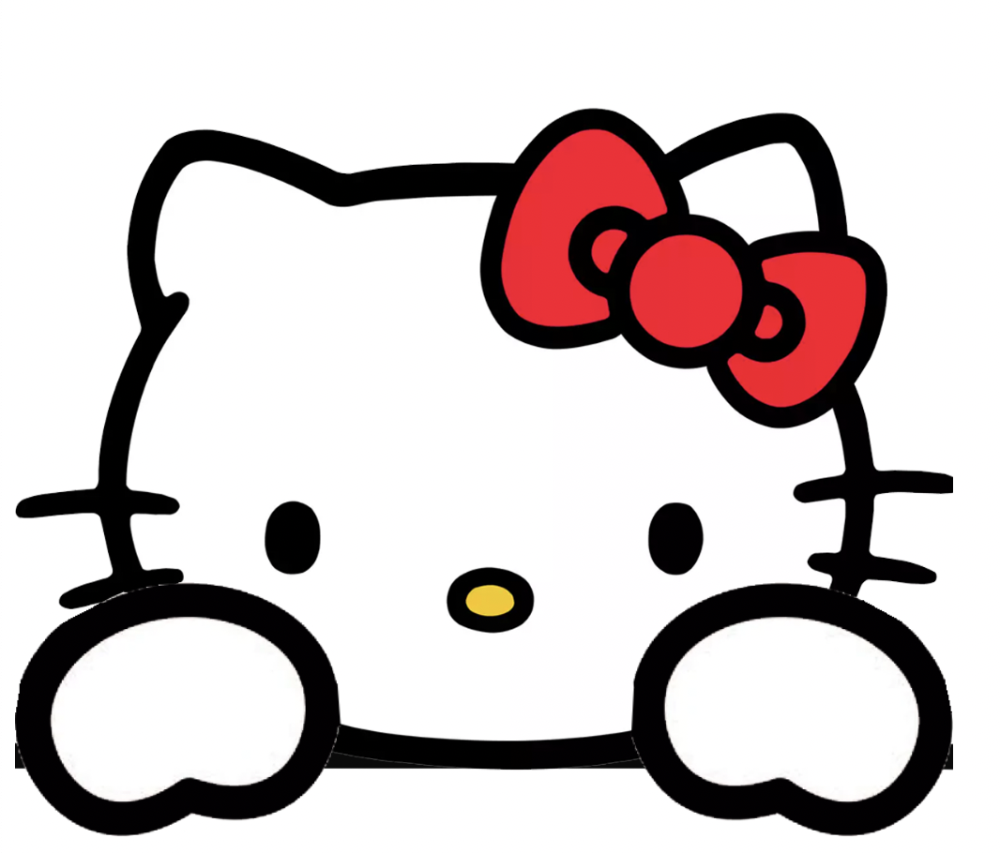
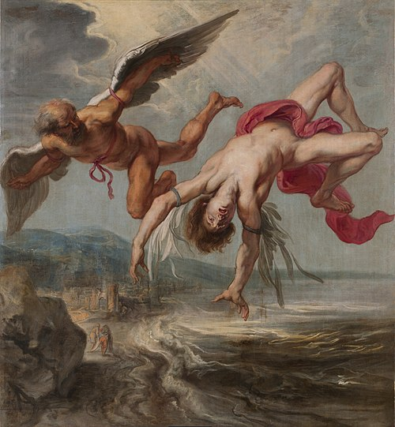
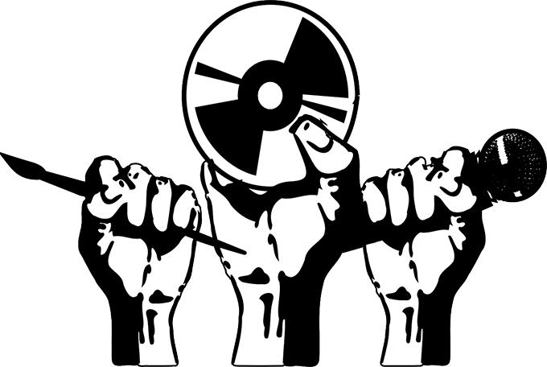



# Open Source

## rust-analyzer

#### #12605 fix auto-links in doc comments: https://github.com/rust-lang/rust-analyzer/pull/12605

https://rust-analyzer.github.io/thisweek/2022/06/27/changelog-135.html

That's me!!!!!

# Misc

## Hello Kitty Table Slam

#### Play at https://erhuve.github.io/hello-kitty-table-slam/

Just a cute little page where you can make Hello Kitty slam the table.

## ML Blog Post

#### Read at https://erhuve.github.io/ml-blog-post/

A quick blog post for the ML class at NYU, Fall 2022.

## Music as Advocacy in the United States

#### Find at https://confluence.gallatin.nyu.edu/context/interdisciplinary-seminar/music-as-advocacy-in-the-united-states

Multimedia research project (video, digital timeline, paper) examining the use of music for social advancement in the United States through a historical and media lens. Nominated and published in Gallatin's Confluence.
