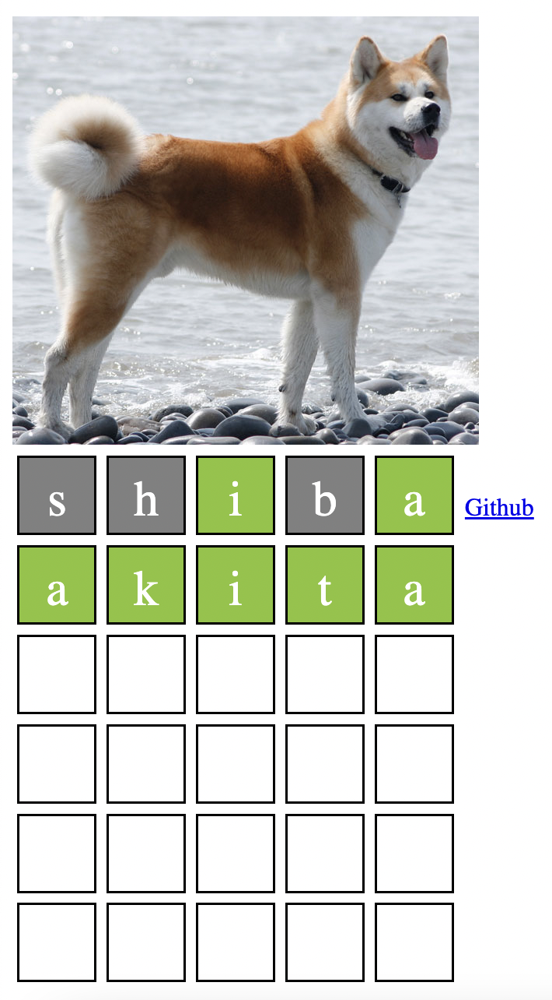
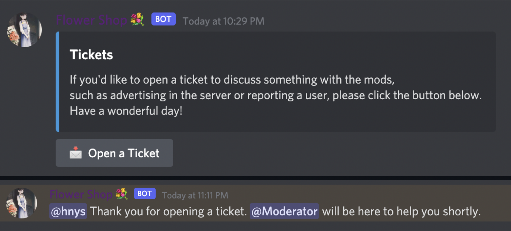
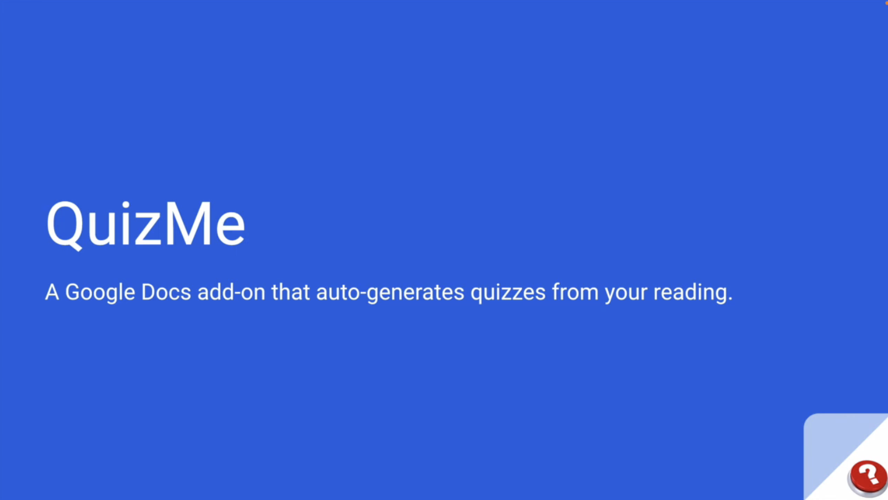
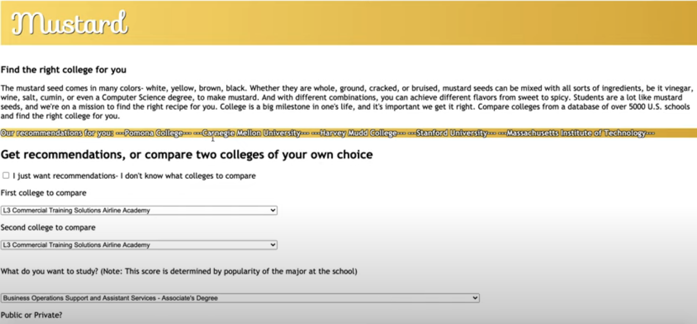
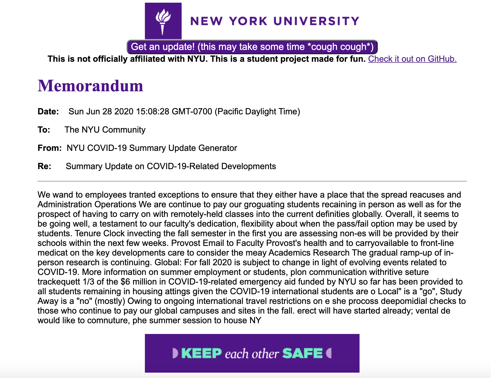



## Doggle: A WASM Game

#### Rust, WASM Bindgen

#### Play at [https://erhuve.github.io/doggle_wasm/](https://erhuve.github.io/doggle_wasm/)

A Wordle-style dog-themed browser game, featuring images and dynamic word lengths. I made this to get started learning Rust and WASM.

---

## Flower Shop: A Discord Ticketing Bot

#### Python, UX Design

#### Code at [https://github.com/erhuve/flowershop](https://github.com/erhuve/flowershop)

A Discord bot with friendly interface and UX for users to open tickets to speak with moderators. I deployed this on Heroku and ran the bot 24/7 on the NYU Discord of 5k+ members.

---

## QuizMe: A Google Docs Extension

#### AppsScript, UX Design

#### Best Potential Hack @ HackNYU 2022

#### Best Use of Google Cloud @ HackNYU 2022

#### More at [https://devpost.com/software/quizme-gp0erh](https://devpost.com/software/quizme-gp0erh)

A Google Docs add-on that empowers reading comprehension through generated quizzes. I did the UX research and design, and also coded the primary business-logic of retrieving and processing question-answer pairs, as well as the layout of the apps-script front end.

---

## Mustard: Find the right college for you

#### Python, Selenium, Firebase, Flask, HTML, CSS, JavaScript

#### More at [https://devpost.com/software/mustard](https://devpost.com/software/mustard)

The mustard seed comes in many colors- white, yellow, brown, black. Whether they are whole, ground, cracked, or bruised, mustard seeds can be mixed with all sorts of ingredients, be it vinegar, wine, salt, cumin, or even a Computer Science degree, to make mustard. And with different combinations, you can achieve different flavors from sweet to spicy. Students are a lot like mustard seeds, and we're on a mission to find the right recipe for you. College is a big milestone in one's life, and it's important we get it right. Compare colleges from a database of over 5000 U.S. schools and find the right college for you.

In this project, we scraped college data with Selenium and created a database with Google Firebase. With this data, we wrote an algorithm to recommend colleges to a user based on various preferences they have. We deployed this into a web app with Flask. Enjoy!

---

## Memorandum Maker

#### Python, TensorFlow, Flask, HTML, CSS, JavaScript

#### Code at [https://github.com/erhuve/memorandum-maker](https://github.com/erhuve/memorandum-maker)

A Flask webapp serving a RNN trained on emails from NYU sent during the emergence of the COVID-19 pandemic.
